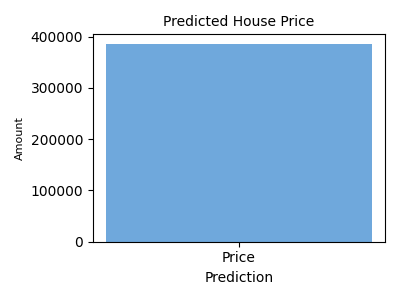

# 🏠 House Price Prediction using Machine Learning

## 📌 Overview
This project predicts house prices based on area, bedrooms, and location using a Machine Learning model integrated with a Flask web application.

---

## 🚀 Features
- Real-time house price prediction
- Location-based input 📍
- Machine Learning model (Random Forest)
- Model accuracy display (R² Score)
- Graph visualization 📊

---

## 🛠 Tech Stack
Python | Flask | Scikit-learn | Pandas | Matplotlib | HTML | CSS

---

## 📸 Output


---

## ▶️ How to Run
```bash
pip install -r requirements.txt
python train_model.py
python app.py